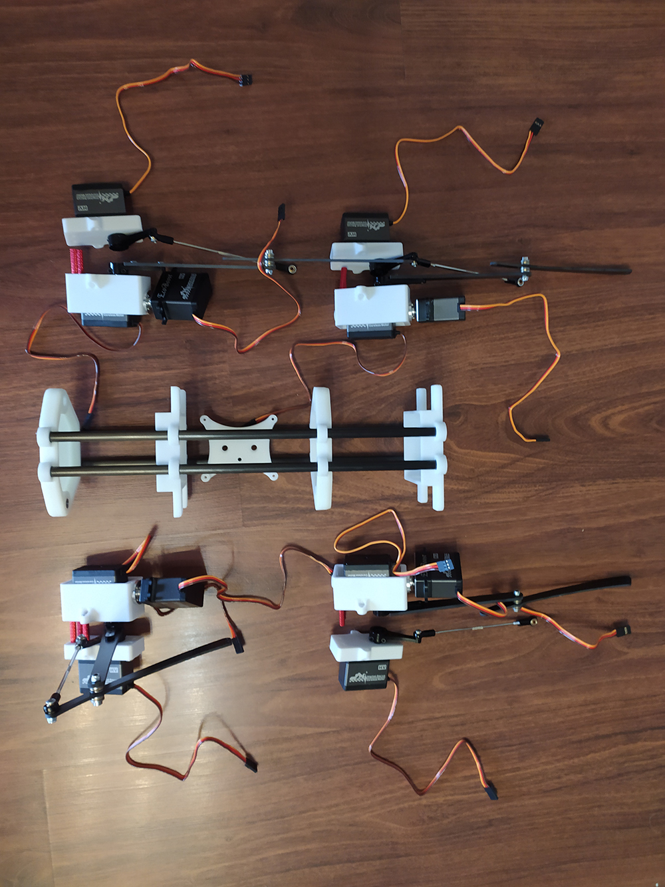

# Blacky
The project originated from [StanfordPupper](https://github.com/stanfordroboticsclub/StanfordQuadruped) ，Designed to improve some structures to achieve better performance, and learn the algorithms used in the pupper. Thanks to Nathan and his team for their work, it ’s really great. Feel free to [raise an issue](https://github.com/blackbox114/blacky/issues/new/choose)  or email me at chen.junfei@nexuslink.cn

### current condition
Still waiting for the revised parts, currently debugging joint motion.

 

### Overview
12Dof, use pi4 and CLS6336servo.

 

### PCB
Added cooling fan, the next step is to integrate the power chip to the board. Find Gerber on this repo , or Visit [this link](https://easyeda.com/blackboxx114/arduboy) .

 

 

### New Structure
curing SLA print+Carbon fiber tube, Lighter and easy to install other modules.

 

