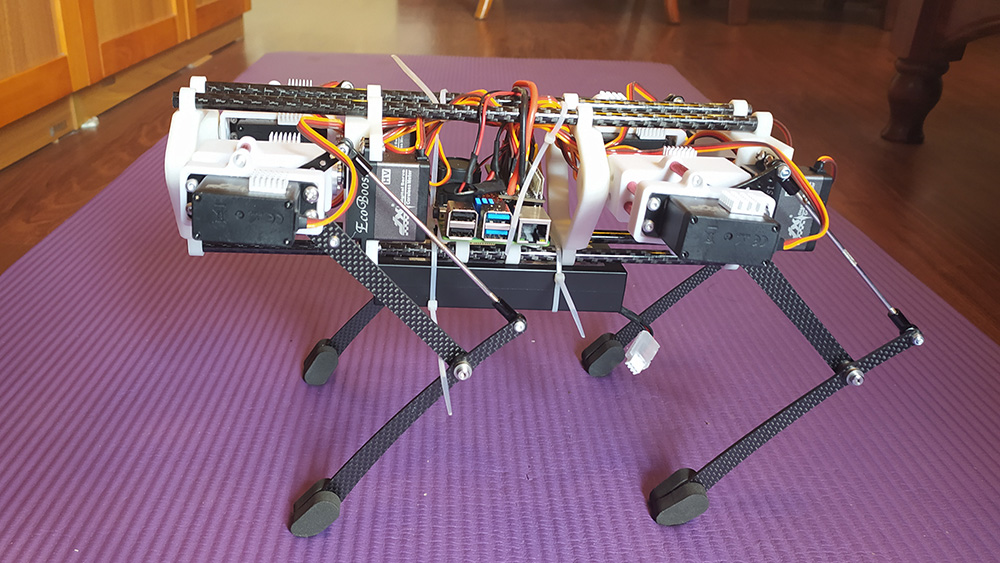
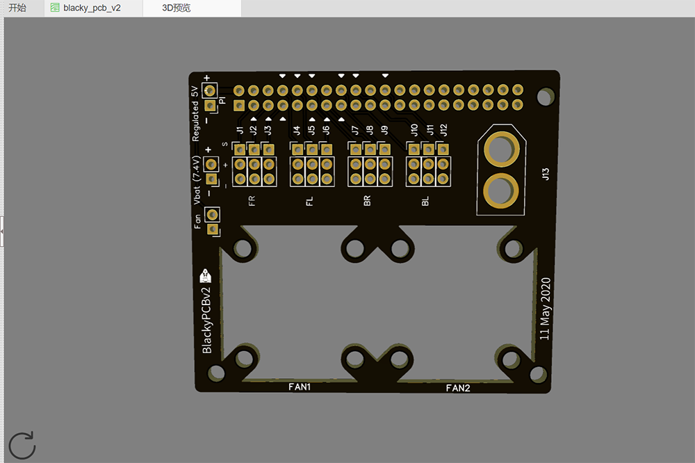
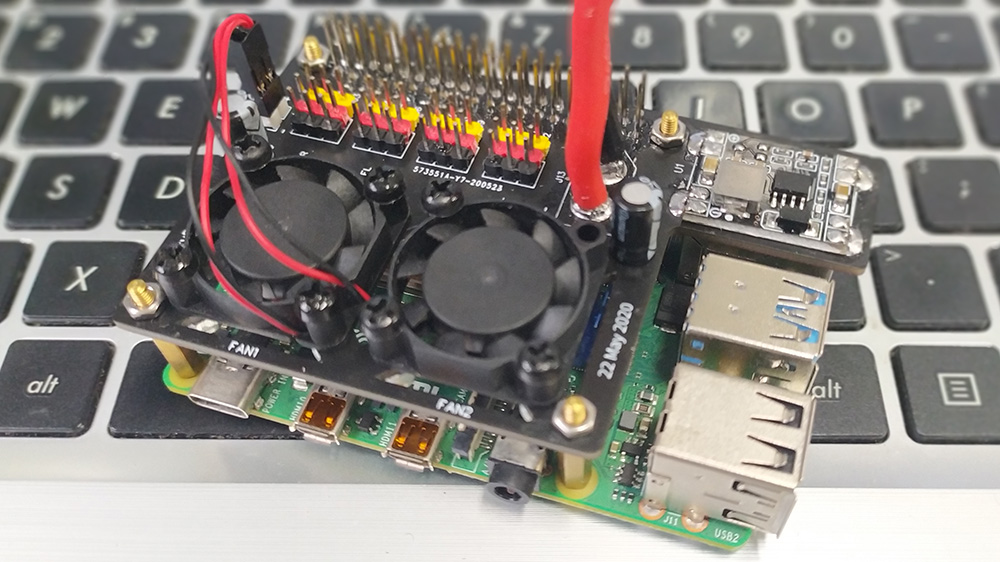

# Blacky
The project originated from [StanfordPpper](https://github.com/stanfordroboticsclub/StanfordQuadruped) ，Designed to improve some structures to achieve better performance, and learn the algorithms used in the pupper. Thanks to Nathan and his team for their work, it ’s really great.

### Overview
Still waiting for the revised parts, currently debugging joint motion

### PCB
Added cooling fan, the next step is to integrate the power chip to the board. Find Gerber on this repo , or Visit this link[this link](https://easyeda.com/blackboxx114/arduboy) .

### New Structure
curing SLA print+Carbon fiber tube, Lighter and easy to install other modules.

